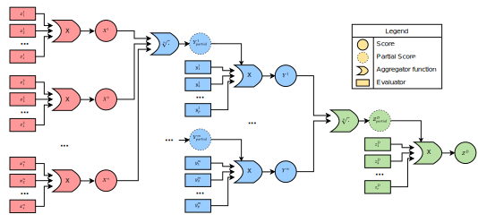

# Preprocess and Score

This pipeline is part of the **ALIA Data Pipeline** project, which aims to provide a set of tools to clean 
and preprocess corpora in order to make them ready to be used for training NLP models.
This step is performed right after deduplicating the corpus.

This pipeline is in charge of **preprocessing and scoring** the documents of a given corpus. 
Basically we take in the document iterator provided by the passed input_format, preprocess the documents with the passed 
preprocessing filters and score them using the passed scoring functions. We also perform language identification if desired 
by the corresponding output_format.

## Module overview

This module is meant to be used by calling the script `preprocess_and_score/clean.py`. 

<a id="filters"></a>
### Preprocessing filters
A [filter](filters_preprocess.py) is a function that takes in a [Sentence](../document.py) and returns a sentence with some modifications (which we call the *clean* sentence). These modifications can be anything, from removing some parts of the document to fixing its encoding, thus returning a *clean*. These are wrapped with the [Filter](processors.py) class, which stores the additional arguments provided to the function, and provides some useful methods to perform the filtering, such as, if the filter removes things, returning the complementary *dirty* sentence (the original sentence without the removed parts).

Check out the [filters](filters_preprocess.py) file for a full list of available filters.

<a id="scores"></a>
### Scoring / Evaluating functions
A [scoring function](evaluators.py) is a function that takes in a [Sentence](evaluators_sentence.py), [Paragraph](evaluators_paragraph.py) or a full [Document](evaluators_document.py) and returns a score between 0 and 1. These are wrapped with the [Evaluator](processors.py) class, which stores the additional arguments provided to the function.

Check out the linked evaluator files for a full list of available scores.

#### BSC-EDU text quality classifier

One of the available document-level scoring functions is **`bscedu_document_evaluator`**, which uses the
[`BSC-LT/bsc-edu-classifier`](https://huggingface.co/BSC-LT/bsc-edu-classifier) model — a transformer-based
text classification regression model trained at the Barcelona Supercomputing Center.

The model assigns a continuous **educational / text-quality score** to each document.  The raw score ranges
from **–2** (very low quality) to **4** (very high quality / educational value), and is linearly normalised
to **[0, 1]** before being incorporated into the pipeline so that it is compatible with all other heuristic
scoring functions and aggregators.

The classifier operates at the **document level**: the full text of the document is tokenised and truncated
to 512 sub-word tokens, then fed to the model in a single forward pass.  Inference is automatically
accelerated with CUDA when a GPU is available; otherwise the model runs on CPU with float32 precision.

**Model loading**: the pipeline checks for the model at `preprocess_and_score/models/bsc-edu-classifier/`.
If the model is not present, it is automatically downloaded from HuggingFace and saved there on the
first run. No manual download is required as long as an internet connection is available.

To activate this evaluator, pass `--bscedu_document_evaluator` to `preprocess_and_score/clean.py` (no extra
arguments are needed; all inference options use optimal defaults):

```bash
python preprocess_and_score/clean.py \
    --metadata_path <metadata.json> --part 0 \
    --input_format_read raw_tsv --input_format_split old_crawling_v2 \
    --output_format clean_jsonl \
    --strategy_name bscedu \
    --bscedu_document_evaluator \
    ...
```

Or use the pre-made SLURM/GREASY launcher at
[`cluster_launchers/preprocess_and_score/bscedu.sh`](../cluster_launchers/preprocess_and_score/bscedu.sh),
which activates the evaluator together with a standard set of heuristic filters and scores and supports
parallelisation via GREASY on MareNostrum 5 or bare SLURM `sbatch` on other clusters.

<a id="aggregators"></a>
### Score aggregators
An [aggregator](aggregators.py) is a function that takes in an arbitrary list of scores and returns a single score. The goal of these functions is to aggregate the scores of the different sentences and paragraphs of a document, together with the different document scores into a single score for the whole document. The process is as follows:

1. For each sentence, s<sub>i</sub> we get a bunch of sentence scores x<sub>i</sub><sup>1</sup>, ...,  x<sub>i</sub><sup>n<sub>i</sub></sup>. We aggregate these scores into a single score X<sub>i</sub> for each sentence using the `sentence_total_aggregator` function.

2. For each paragraph, p<sub>j</sub> we get a bunch of scores y<sub>j</sub><sup>1</sup>, ...,  y<sub>j</sub><sup>m<sub>j</sub></sup>, as well as the total scores of its sentences X<sub>i</sub> for each sentence s<sub>i</sub> in the paragraph.

   1. We aggregate the scores X<sub>i</sub> of the sentences of the paragraph into a single score Y<sub>j</sub><sup>partial</sup> using the `paragraph_partial_aggregator` function.
   2. We aggregate the scores of the paragraph y<sub>j</sub><sup>v</sup> and the partial score Y<sub>j</sub><sup>partial</sup> into a single score Y<sub>j</sub> using the `paragraph_total_aggregator` function.

3. For each document, d<sub>k</sub> we get a bunch of scores z<sub>k</sub><sup>1</sup>, ...,  z<sub>k</sub><sup>r<sub>k</sub></sup>, as well as the total scores of its paragraphs Y<sub>j</sub> for each paragraph p<sub>j</sub> in the document.

   1. We aggregate the scores Y<sub>j</sub> of the paragraphs of the document into a single score Z<sub>k</sub><sup>partial</sup> using the `document_partial_aggregator` function.
   2. We aggregate the scores of the document z<sub>k</sub><sup>w</sup> and the partial score Z<sub>k</sub><sup>partial</sup> into a single final score Z<sub>k</sub> using the `document_total_aggregator` function.

<p align="center">
  
</p>

Check out the [aggregators](aggregators.py) file for a full list of available aggregators. Mainly we use the product of the scores as total aggregator, and the geometric mean as partial aggregator.


## Setup
Remember, all provided scripts are meant to be executed from the root folder of the project.

If we want to do language identification, we need to first install the language identification model:

```bash
bash preprocess_and_score/download_language_identifier.sh
```

If you don't have internet access, you can download the model manually from [here](https://dl.fbaipublicfiles.com/fasttext/supervised-models/lid.176.bin) 
and place it under the folder `preprocess_and_score/`.

Next, you will need to install the python dependencies. We recommend using a virtual environment:

```bash
python3 -m venv venv
source venv/bin/activate
pip install -r preprocess_and_score/requirements.txt
```

If you are working in the BSC cluster, this step is not needed, just run the environment script:

```bash
source preprocess_and_score/use_venv_amd.sh
```

or

```bash
source preprocess_and_score/use_venv_nord3.sh
```
 


## Usage

### Cleaning a part directly

The pipeline is meant to be used by calling the script `preprocess_and_score/clean.py`.

#### Arguments reference

Below is a full description of all command-line arguments accepted by `preprocess_and_score/clean.py`.

**General arguments** (defined in [`arguments.py`](arguments.py)):

| Argument | Type | Default | Description |
|---|---|---|---|
| `--no_filter` | flag | `False` | Skip all preprocessing filters; only scoring will be applied. |
| `--strategy_name` | `str` | *(required)* | Name to use for the final score stored in each document. |
| `--sentence_total_aggregator` | `str` | `product` | Aggregator function used to combine all sentence-level scores into a single sentence score. |
| `--paragraph_partial_aggregator` | `str` | `geometric_mean` | Aggregator function used to combine sentence scores within a paragraph into a single partial paragraph score. |
| `--paragraph_total_aggregator` | `str` | `product` | Aggregator function used to combine all paragraph-level scores (including the partial one) into a single paragraph score. |
| `--document_partial_aggregator` | `str` | `geometric_mean` | Aggregator function used to combine paragraph scores within a document into a single partial document score. |
| `--document_total_aggregator` | `str` | `product` | Aggregator function used to combine all document-level scores (including the partial one) into the final document score. |
| `--clean_already_cleaned` | flag | `False` | Re-clean files that have already been processed (MongoDB input only). |
| `--do_not_clean` | flag | `False` | Skip all cleaning and just translate between formats. |
| `--calculate_dirty` | flag | `False` | Track and output the text that was removed by each filter (the *dirty* content). |
| `--max_docs` | `float` | `inf` | Maximum number of documents to process. Useful for testing. |

**I/O arguments** (defined in [`../io_args.py`](../io_args.py)):

| Argument | Type | Default | Description |
|---|---|---|---|
| `--input_format_read` | `str` | *(required)* | Input format used to read the raw file and yield `Document` objects. See [`input_formats.py`](../input_formats.py) for available formats. |
| `--input_format_split` | `str` | same as `input_format_read` | Input format used to split documents into paragraphs and sentences. May differ from `input_format_read`. |
| `--output_format` | `str` | *(required)* | Output format used to write the processed documents. See [`output_formats.py`](../output_formats.py) for available formats. |
| `--metadata_path` | `str` | *(required)* | Path to the JSON metadata file that describes the corpus and its file paths. |
| `--part` | `str` | *(required)* | Corpus part identifier to process. |
| `--override_output` | flag | `False` | Overwrite the output files if they already exist. |
| `--language_priorities` | `list[str]` | `[]` | Ordered list of ISO 639-1 language codes to keep. Documents whose dominant language is not in this list may be filtered depending on the output format. |
| `--language_threshold` | `float` | `0.5` | Minimum ratio a language must have in a document to be considered its dominant language. |
| `--testing` | flag | `False` | Redirect both input and output to the testing folder. |
| `--testing_input` | flag | `False` | Redirect only input to the testing folder. |
| `--testing_output` | flag | `False` | Redirect only output to the testing folder. |
| `--testing_folder` | `str` | `test_data` | Path to the testing folder used when any `--testing*` flag is active. |

**Filter arguments** (defined in [`filters_preprocess.py`](filters_preprocess.py)):

Each filter is activated by passing its name as a flag followed by its parameters (use `'*'` to keep the default value for a parameter). For example:

```bash
--fix_encoding_filter          # no parameters
--remove_newlines_filter '*'   # one parameter, use default
--strip_filter                 # no parameters
```

Refer to [`filters_preprocess.py`](filters_preprocess.py) for the full list of available filters and their parameters.

**Scoring / evaluator arguments** (defined in [`evaluators_sentence.py`](evaluators_sentence.py), [`evaluators_paragraph.py`](evaluators_paragraph.py), [`evaluators_document.py`](evaluators_document.py)):

Each evaluator is activated by passing its name as a flag followed by its parameters (use `'*'` to keep the default value for a parameter).  For example:

```bash
--last_char_sentence_evaluator '*'
--alnum_evaluator_v2 '*' '*'
--bscedu_document_evaluator    # no parameters; uses optimal defaults
```

Refer to the evaluator files for the full list of available evaluators and their parameters.

---

The comand-line arguments you pass in will depend on what [filters](#filters) and [scoring functions](#scores) you want to use, 
as well as the [input format](../README.md#input-formats) and [output format](../README.md#output-formats) you want to use. For file-based input and formats (which is the most common case as opposed to database-based input),
you will also need to pass the path to the metadata file of the corpus you want to process. A good starting point is to 
take a look at the [example bash script](clean_example.sh) provided, which you should be able to run directly:

```bash
bash preprocess_and_score/clean_example.sh
```

(Note that you should edit these files to change where the virtual environment is located)

In this file you can see how the various filter and evaluators to use with their arguments
are passed to the script, in a similar manner to how the
[document checks](../README.md#document-checks) are passed to a generic module.

You should get out a ```test_data/clean``` folder with subfolders for each language selected through the 
```--language_priorities``` argument. Each of these subfolders will contain the cleaned and scored documents in the
format specified (in this case, the default format is ```tsv```).

### Cleaning all parts of a corpus with a file-based input format

For file-based input formats, you can also use the [script](clean_whole_metadata.py) to clean all parts of a corpus that has already been
[deduplicated](../deduplicate) in the raw_tsv [input format](../input_formats.py).

This script will look for the metadata file of the corpus in the path specified by the `--metadata_path` argument, and will
clean all parts of the corpus that are specified in the metadata file in parallel using the `sbatch` command.

As command-line arguments, you should specify:

* `--metadata_path`, which should be the path to the metadata file of the corpus you want to clean.
* `--input_format_split` which should be the same as the `input_format` one used in the [deduplication](../deduplicate) step.
* `--clean_setup`, to tell the script which [filters](#filters) and [scoring functions](#scores) you want to use. You should pass in the name of any of the launchers at [cluster_launchers/preprocess_and_score](../cluster_launchers/preprocess_and_score). Available options include:
  * `not_testing.sh` — standard heuristic-only setup.
  * `testing.sh` — same as `not_testing.sh` but passes the `--testing` flag so data is read/written from the testing folder.
  * `bscedu.sh` — full setup that combines all standard heuristic filters and evaluators **plus** the `bscedu_document_evaluator` neural quality classifier. Suitable for GPU-enabled SLURM nodes or CPU-only nodes.
* `--venv_script`, which should be the path to the script that activates the virtual environment 
(usually `venv/bin/activate`, but in the clusters you may want to pass a bash file that does 
additional stuff, such as `use_venv_amd.sh`).

* `--clean_already_clean`, to decide whether to clean parts that have already been cleaned or not (this
is checked by checking if the stats file of the corresponding part already exists). 
It is false by default. If it is passed, it will be set to true.

* `--sbatch`, to decide if all parts should be cleaned in parallel using the `sbatch` command.
It is false by default. If it is passed, it will be set to true.

* `--greasy`, to decide if you want to execute everything immediately,
or write the commands to an intermediate greasy file. It is false by default. 
If it is passed, it will be set to true.
Note that this argument overrides the `--sbatch` argument (greasy files are always executed in parallel).

* `--greasy_path`, which should be the path to the greasy file where the commands will be written if the `--greasy` argument is passed.

Optionally, as in the [I/O args](../README.md#io-arguments), you can also pass in:
* `--testing`, which means all input and output data will be reparented to the testing folder
It is false by default. If it is passed, it will be set to true.
*  `--testing_input`, which means that the input will be taken from the testing folder. It is False by default.
If it is passed, it will be set to True.
* `--testing_output`, which means that the output will be stored in the testing folder. It is False by default.
* `--testing_folder`, which should be the path to the folder where the input or output of the script will be stored 
in testing mode. It is `test_data` by default.

This is an example of the use of this script. First, we provide an example deduped corpus.
For this example's sake, we will use the [naive deduplication script](../deduplicate/naive_deduplicator.py) to deduplicate
the test corpus since it's extremely small and we don't need to use the more complex deduplication scripts which require 
Greasy to be installed (see ../deduplicate/README.md for more information).

```bash
python deduplicate/naive_deduplicator.py --metadata_path test_data/data/02-metadata/test_mx_20240325.json --input_format_read old_crawling_v2 --output_format raw_tsv 
```

This will create a `test_data/test1` folder with the deduplicated corpus.

Then, we can run the script:

```bash
python preprocess_and_score/clean_whole_metadata.py --metadata_path test_data/data/02-metadata/test_mx_20240325.json --clean_setup not_testing.sh --input_format_split old_crawling_v2 --venv_script venv/bin/activate
````

Note that if you pass in the `--testing` argument, you should pass `testing.sh` as the `--clean_setup` argument, because it will pass on the `--testing` argument to the `clean.py` script.

The script will specify, for each part, whether it has already been cleaned or not, and whether it will be cleaned or not.
If some parts are not deduplicated, the script will ignore them and will print a warning.

### Running the BSC-EDU classifier setup on a SLURM/GREASY cluster

To run the full pipeline with the BSC-EDU neural quality classifier on MareNostrum 5 (or any other
cluster that supports SLURM and GREASY), use:

```bash
python preprocess_and_score/clean_whole_metadata.py \
    --metadata_path <path/to/metadata.json> \
    --clean_setup bscedu.sh \
    --input_format_split <input_format> \
    --venv_script <path/to/activate.sh> \
    --greasy \
    --greasy_path <path/to/output.greasy>
```

The GREASY file will be created at `--greasy_path`.  You can then submit it to the cluster with:

```bash
sbatch --ntasks=<N> greasy <path/to/output.greasy>
```

On clusters without GREASY (e.g. LUMI), pass `--sbatch` instead of `--greasy` to submit one independent `sbatch` job per corpus part.

